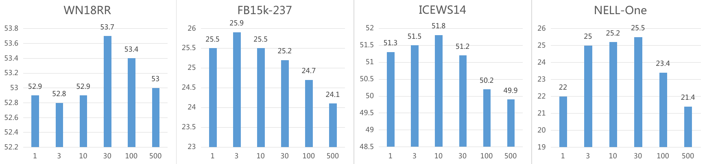
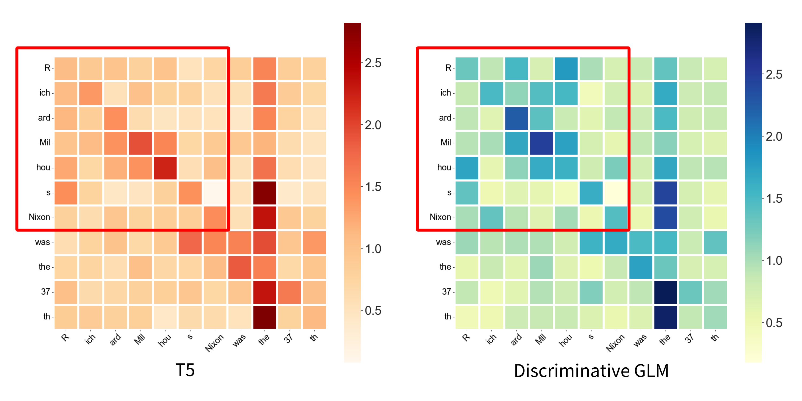

# A.  Discussion on the step 1 (Section 3.3)

After a large number of experiments, we found that there is an error in “set the number of clusters to 30“ in line 354. In fact, the number of clusters significantly affects the results of entity classification, leading to changes in the results of link prediction.

             
Figure a: Research on parameter sensitivity to the number of clusters. 
 

The horizontal axis in the above figure represents the number of clusters, while the vertical axis represents Hits@1 . Consistent with the ablation experiment, we also removed steps 2 and 3. We can see a significant correlation between the number of clusters and the final result. We speculate that for different KGs, the number of clusters should be positively correlated with the sparsity of the knowledge graph, that is, with the proportion of entities and triples in the knowledge graph. The experiment shows that step 1 performs well in WN18RR, ICEWS14, and NELL-One knowledge graphs, but performs poorly in FB15k-237. This may be due to the latter being more well constructed and the knowledge graph being denser.

# B. Discussion on the step 2 (Section 3.4)

We will visualize the attention weights of the last layer of fine-tuned T5 and discriminative GLM encoder to verify that our model can better capture the concept of entities.

             
Figure b: Attention weights of the last layers of fine-tuned T5 and discriminative GLM encoder. 
 

As shown in the red box in the figure, for discriminative GLM, token pairs with the same entity concept receive more attention. For example, for the entity "Richard Milhous Nixon", it consists of seven tokens, and the attention weight between them should be significant. However, this strong relationship was not proven in the fine-tuned T5. Our model strengthens this relationship. Therefore, we believe that the reason why discriminative GLM works may be that tokens belonging to the same concept are marked in the GLM vocabulary.

# C. Additional ablation experiments

We decide to add ablation experiments in other KGs.

<table class="tg">
<thead>
  <tr>
    <th class="tg-c3ow" rowspan="2">S1</th>
    <th class="tg-c3ow" rowspan="2">S2</th>
    <th class="tg-c3ow" rowspan="2">S3</th>
    <th class="tg-c3ow" colspan="3">WN18RR</th>
    <th class="tg-c3ow" colspan="3">FB15k-237</th>
    <th class="tg-c3ow" colspan="3">ICEWS14</th>
    <th class="tg-c3ow" colspan="3">NELL-One</th>
  </tr>
  <tr>
    <th class="tg-c3ow">MRR</th>
    <th class="tg-c3ow">H@1</th>
    <th class="tg-c3ow">H@3</th>
    <th class="tg-c3ow">MRR</th>
    <th class="tg-c3ow">H@1</th>
    <th class="tg-c3ow">H@3</th>
    <th class="tg-c3ow">MRR</th>
    <th class="tg-c3ow">H@1</th>
    <th class="tg-c3ow">H@3</th>
    <th class="tg-c3ow">MRR</th>
    <th class="tg-c3ow">H@1</th>
    <th class="tg-c3ow">H@5</th>
  </tr>
</thead>
<tbody>
  <tr>
    <td class="tg-c3ow">&times;</td>
    <td class="tg-c3ow">&times;</td>
    <td class="tg-c3ow">&times;</td>
    <td class="tg-c3ow">57.3</td>
    <td class="tg-c3ow">52.9</td>
    <td class="tg-c3ow">59.4</td>
    <td class="tg-c3ow">33.4</td>
    <td class="tg-c3ow">25.5</td>
    <td class="tg-c3ow">37.1</td>
    <td class="tg-c3ow">59.3</td>
    <td class="tg-c3ow">51.3</td>
    <td class="tg-c3ow">63.9</td>
    <td class="tg-c3ow">30.8</td>
    <td class="tg-c3ow">21.9</td>
    <td class="tg-c3ow">40.7</td>
  </tr>
  <tr>
    <td class="tg-c3ow">&#x2713;</h3></td>
    <td class="tg-c3ow">&times;</td>
    <td class="tg-c3ow">&times;</td>
    <td class="tg-c3ow">58.1</td>
    <td class="tg-c3ow">53.8</td>
    <td class="tg-c3ow">60.5</td>
    <td class="tg-c3ow">33.3</td>
    <td class="tg-c3ow">25.6</td>
    <td class="tg-c3ow">36.9</td>
    <td class="tg-c3ow">59.8</td>
    <td class="tg-c3ow">51.8</td>
    <td class="tg-c3ow">64.7</td>
 	<td class="tg-c3ow">34.0</td>
    <td class="tg-c3ow">25.5</td>
    <td class="tg-c3ow">43.2</td>
  </tr>
  <tr>
    <td class="tg-c3ow">&#x2713;</h3></td>
    <td class="tg-c3ow">&#x2713;</h3></td>
    <td class="tg-c3ow">&times;</td>
    <td class="tg-c3ow">58.3</td>
    <td class="tg-c3ow">54.0</td>
    <td class="tg-c3ow">60.7</td>
    <td class="tg-c3ow">33.8</td>
    <td class="tg-c3ow">25.9</td>
    <td class="tg-c3ow">37.5</td>
    <td class="tg-c3ow">59.9</td>
    <td class="tg-c3ow">52.1</td>
    <td class="tg-c3ow">65.0</td>
 	<td class="tg-c3ow">34.2</td>
    <td class="tg-c3ow">25.8</td>
    <td class="tg-c3ow">43.2</td>
  </tr>
  <tr>
    <td class="tg-c3ow">&#x2713;</h3></td>
    <td class="tg-c3ow">&#x2713;</h3></td>
    <td class="tg-c3ow">&#x2713;</h3></td>
    <td class="tg-c3ow">58.6</td>
    <td class="tg-c3ow">54.6</td>
    <td class="tg-c3ow">61.0</td>
    <td class="tg-c3ow">36.1</td>
    <td class="tg-c3ow">28.1</td>
    <td class="tg-c3ow">40.1</td>
    <td class="tg-c3ow">60.7</td>
    <td class="tg-c3ow">52.9</td>
    <td class="tg-c3ow">65.4</td>
    <td class="tg-c3ow">34.2</td>
    <td class="tg-c3ow">25.8</td>
    <td class="tg-c3ow">43.2</td>
  </tr>
</tbody>
</table>

 
            
